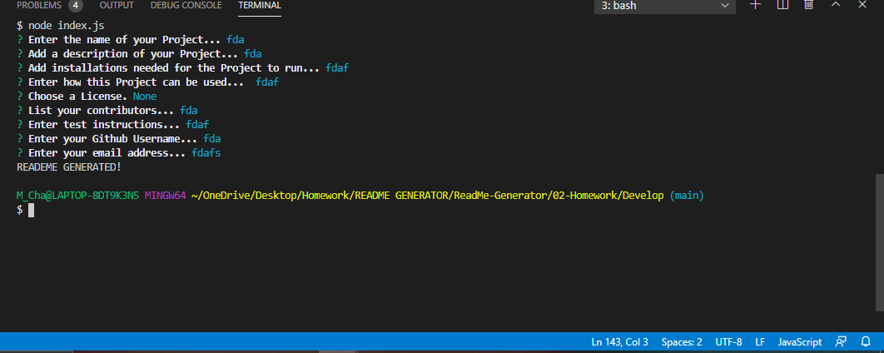
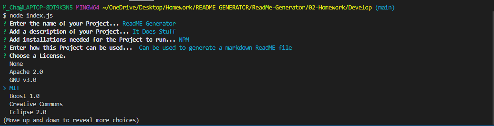
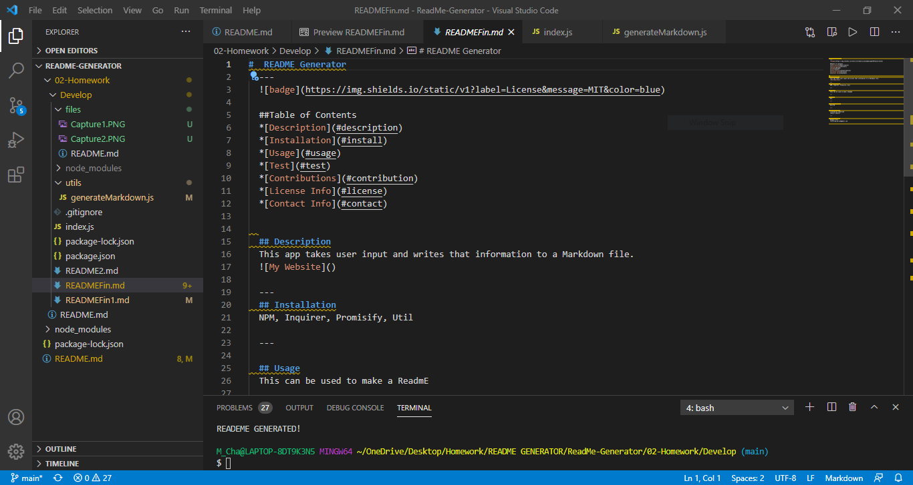

# **ReadMe-Generator**

## **Description**
This is an application that will ask for user input to fill out various fields that will make up their README. Once that information is given, a Markdown file will be generated.

This was an intersting project. Learning more about NPM and the packages available with it was fun. Also being able to implement new concepts learned with Node. js.

---
## **Tutorial**
[

Tutorial Video Link Here: [TUTORIAL!](https://drive.google.com/file/d/1vdOcCibjNXyh0AKo8QyI63w-uVZb8xGM/view)
---
## Screenshots

---
## **Tools Used**

* VS Code
* NPM
* Inquirer
* Node.js

---

## **Resources**

* [Inquirer](https://www.npmjs.com/package/inquirer#prompt)
* [Shields.io](https://shields.io/)
* [MDN](https://developer.mozilla.org/en-US/docs/Web/JavaScript)
